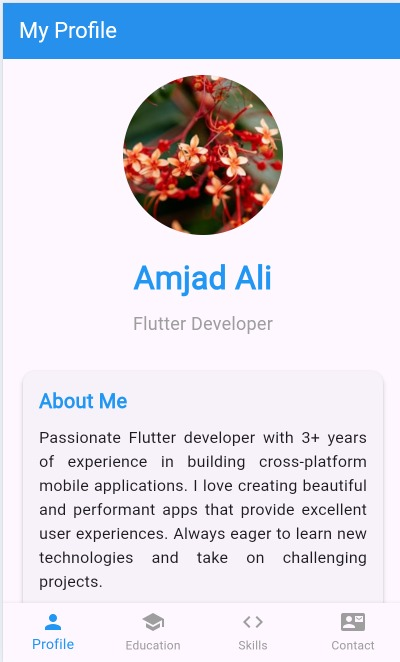
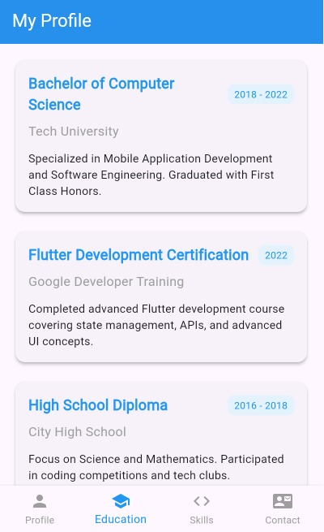
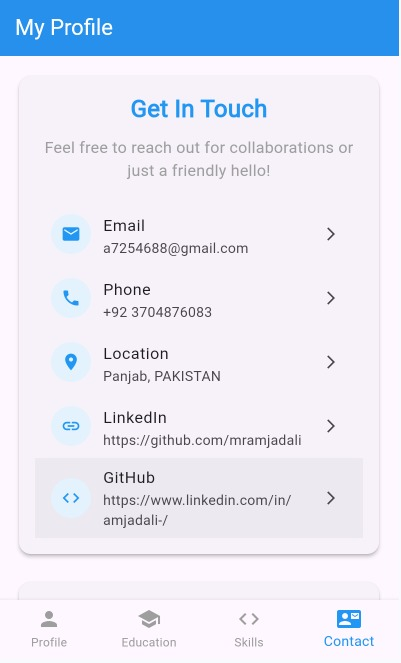

# Flutter Profile App

A beautiful and responsive Flutter profile application with bottom navigation.

## 📱 Screenshots

<div align="center">
  
### Home Screen


### Education Screen  


### Skills Screen


### Contact Screen


</div>

## ✨ Features

- 👤 Personal profile with photo and bio
- 🎓 Education section with timeline
- 💼 Skills with progress indicators  
- 📞 Contact information and message form
- 📱 Responsive design
- 🧭 Bottom navigation bar

## 🚀 Installation

```bash
# Clone the repository
git clone https://github.com/mramjadali/Profile-App.git

# Navigate to project
cd Profile-App

# Install dependencies
flutter pub get

# Run the app
flutter run
```

## 🛠 Technologies Used

- Flutter
- Dart
- Material Design

## 📦 Project Structure

```
lib/
├── main.dart
└── screens/
    ├── profile_screen.dart
    ├── home_tab.dart
    ├── education_tab.dart
    ├── skills_tab.dart
    └── contact_tab.dart
```

## 👨‍💻 Created by

[mramjadali](https://github.com/mramjadali)
This project is a starting point for a Flutter application.

A few resources to get you started if this is your first Flutter project:

- [Lab: Write your first Flutter app](https://docs.flutter.dev/get-started/codelab)
- [Cookbook: Useful Flutter samples](https://docs.flutter.dev/cookbook)

For help getting started with Flutter development, view the
[online documentation](https://docs.flutter.dev/), which offers tutorials,
samples, guidance on mobile development, and a full API reference.
